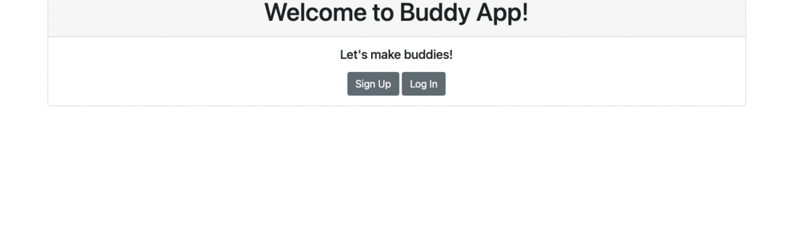

<div id="top"></div>

<!-- PROJECT SHIELDS -->
<!--
*** https://www.markdownguide.org/basic-syntax/#reference-style-links
-->

![app-shield]
![purpose-shield]
![project-title]

<!-- PROJECT IMAGE -->
<div align="center">
  
</div>

<!-- TABLE OF CONTENTS -->
<details>
  <summary>Table of Contents</summary>
  <ol>
    <li>
      <a href="#about-the-project">About The Project</a>
      <ul>
        <li><a href="#build-with">Build With</a></li>
        <li><a href="#gems-used">Gems Used</a></li>
        <li><a href="#entity-relationship-diagram">ER Diagram</a></li>
      </ul>
    </li>
    <li>
      <a href="#getting-started">Getting Started</a>
      <ul>
        <li><a href="#prerequisites">Prerequisites</a></li>
        <li><a href="#installation">Installation</a></li>
      </ul>
    </li>
    <li><a href="#usage">Usage</a></li>
    <!-- <li><a href="#acknowledgments">Acknowledgments</a></li> -->
  </ol>
</details>

<!-- ABOUT THE PROJECT -->

## About The Project

This is a Rails CRUD application built out for practice purposes. CRUD operations are commonly used in web development and it stands for:

- Create
- Read
- Update
- Delete

Through developing this very simple, functional [Buddies List][project-url] application, I was trying to get a better understanding of Rails principles of the MVC architecture (Model-View-Controller pattern). For a demonstration, please refer to the [Usage](#usage).
<br>

### Build With

- [Ruby](https://github.com/ruby/ruby)
- [Rails](https://github.com/rails/rails)
- [HTML](https://developer.mozilla.org/en-US/docs/Web/HTML)
- [Bootstrap](https://getbootstrap.com/)
- [PostgreSQL](https://www.postgresql.org/)
  <br>

### Gems Used

- [devise](https://rubygems.org/gems/devise) : Flexible authentication solution for Rails with Warden
- [faker](https://github.com/faker-ruby/faker) : Faker, a port of Data::Faker from Perl, is used to easily generate fake data: names, addresses, phone numbers, etc.
- [pry-byebug](https://rubygems.org/gems/pry-byebug) : Combine 'pry' with 'byebug'. Adds 'step', 'next', 'finish', 'continue' and 'break' commands to control execution.
- [rspec-rails](https://github.com/rspec/rspec-rails) : rspec-rails is a testing framework for Rails 5+.
- [factory_bot_rails](https://github.com/thoughtbot/factory_bot_rails) : factory_bot_rails provides integration between factory_bot and rails 5.0 or newer.
- [pry-doc](https://github.com/pry/pry-doc) : Pry Doc is a Pry REPL plugin.
- [better_errors](https://github.com/BetterErrors/better_errors) : Provides a better error page for Rails and other Rack apps. Includes source code inspection, a live REPL and local/instance variable inspection for all stack frames.

  <br>

### Entity Relationship Diagram


<p align="right"><a href="#top">back to top</a></p>
<br>

<!-- GETTING STARTED -->

## Getting Started

Below are instructions on getting you a copy of the project up and running on your local machine for development purposes.
<br>

### Prerequisites

- bundler

  ```sh
  gem install bundler
  ```

- yarn (it is recommended to install Yarn through the [npm package manager][npm-url])

  ```sh
  npm install --global yarn
  ```

  <br>

### Installation

1. Clone the repo

   ```sh
   git clone https://github.com/Ikko-T/buddies-list.git
   ```

2. Change the directory

   ```sh
   cd buddies-list
   ```

3. Install the dependencies specified in Gemfile

   ```sh
   bundle install
   ```

4. Create a database

   ```sh
   rails db:create
   ```

<p align="right"><a href="#top">back to top</a></p>
<br>

<!-- USAGE EXAMPLES -->

## Usage



<p align="right"><a href="#top">back to top</a></p>

<!--MARKDOWN LINKS & IMAGES -->

[app-shield]: https://img.shields.io/badge/APP-3%20%2F%2020-brightgreen
[project-title]: https://img.shields.io/badge/PROJECT%20TITLE-Buddies%20List-orange
[purpose-shield]: https://img.shields.io/badge/PURPOSE-Coding%20Challenge%20Websites-blue
[project-url]: https://buddies-list-production.herokuapp.com/
[npm-url]: https://www.npmjs.com/

```

```
